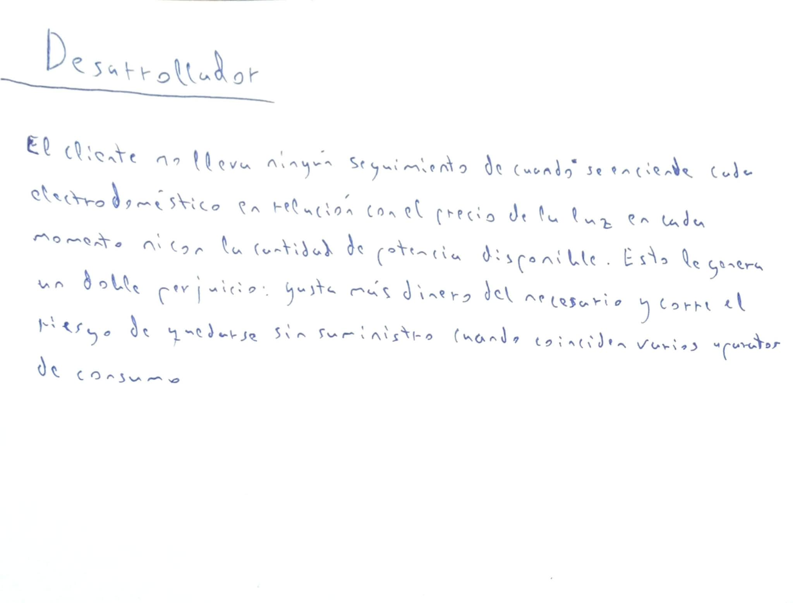
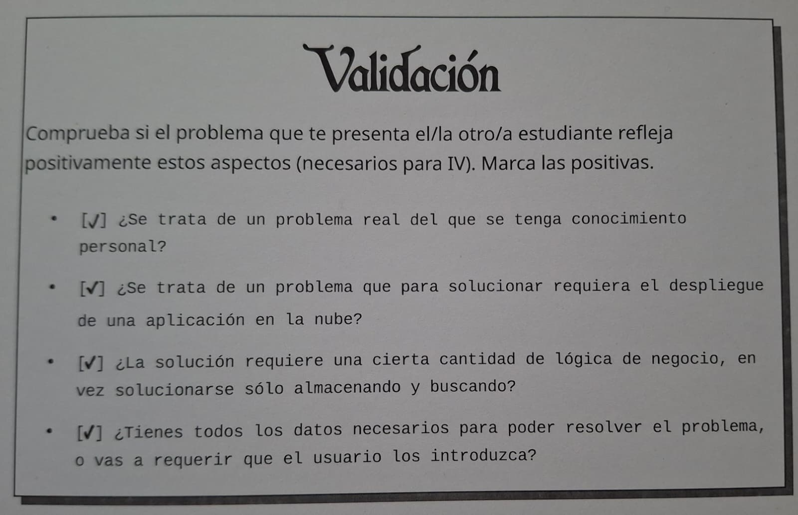

# Optimizador del consumo eléctrico

## Descripción del problema

Hablando con mi tía, me contó que ella revisa cada tarde el precio de la luz por horas antes de decidir cuándo poner la lavadora o el aire acondicionado, y así ahorrar en la factura. 
En cambio, en mi casa nadie hace ese cálculo, sino que cada electrodoméstico se enciende cuando se necesita.
En mi caso el margen es estrecho, ya que tenemos 3,45kW contratados y algunos electrodomésticos de gran consumo: 3 aires acondicionados, 1 horno, 1 vitrocerámica, 1 lavadora y 1 brasero. Por lo tanto, más de una vez nos ha pasado que han coincidido encendidos dos de estos aparatos y nos hemos acercado al límite, incluso haciendo que salte el ICP (Interruptor de Control de Potencia).
Esto afecta a cualquier hogar con este tipo de tarifas y con una potencia contratada limitada, especialmente a quiénes tienen varios electrodomésticos de consumo alto y no llevan un control del precio y de la potencia de cada uno.

## Tarjetas de rol y configuración del repositorio

### Juego de rol

Ficha del cliente

Ficha del desarrollador

Ficha de validación

### Configuración previa realizada

[Clave SSH](fotos/ssh.png)

[Configuración SSH](fotos/sshconfig.png)

## Lista de comprobación

**¿Se trata de un problema real del que se tenga conocimiento personal?**

Sí, es un problema que vivo en mi propia casa. Con la potencia que tenemos contratada, alguna vez se nos ha ido la luz cuando usamos varios electrodomésticos de consumo alto.

**¿Se trata de un problema que para solucionar requiera el despliegue de una aplicación en la nube?**

Sí. El precio del día siguiente lo publica la Red Eléctrica Española cada tarde, y el cálculo del horario óptimo debe hacerse justo después, todos los días y sin necesidad de que nadie tenga que acordarse de ello. 
Si hubiera que tener un ordenador encendido justo en ese momento, fallaría cualquier día que no hubiera nadie pendiente.

**¿La solución requiere una cierta cantidad de lógica de negocio, en vez de solucionarse sólo almacenando y buscando?**

Correcto. Hay que calcular, para cada electrodoméstico programable, en qué franjas horarias encenderlo, y teniendo en cuenta que el coste total, según el precio de cada hora, sea el mínimo posible. También habrá que tener en cuenta que la suma de potencias activas en cualquier momento no supere la potencia contratada.

**¿Se ha incluido la configuración del repositorio y se ha enlazado desde el 'README'?**

Sí, todas las capturas requeridas se han incluido arriba.

**¿Se ha incluido y enlazado correctamente la fotografía de la tarjeta del juego de rol en el 'README' subiéndola al repositorio?**

Sí, las imágenes necesarias se han subido al repositorio y están enlazadas arriba.

**¿El estudiante tiene todos los datos necesarios para poder resolver el problema, o va a requerir que el usuario los introduzca?**

El precio de la luz según la hora es un dato público, la potencia contratada la he obtenido de mi propia factura, y el consumo y duración de cada electrodoméstico programable se ha obtenido de su etiqueta energética o de su ficha técnica.